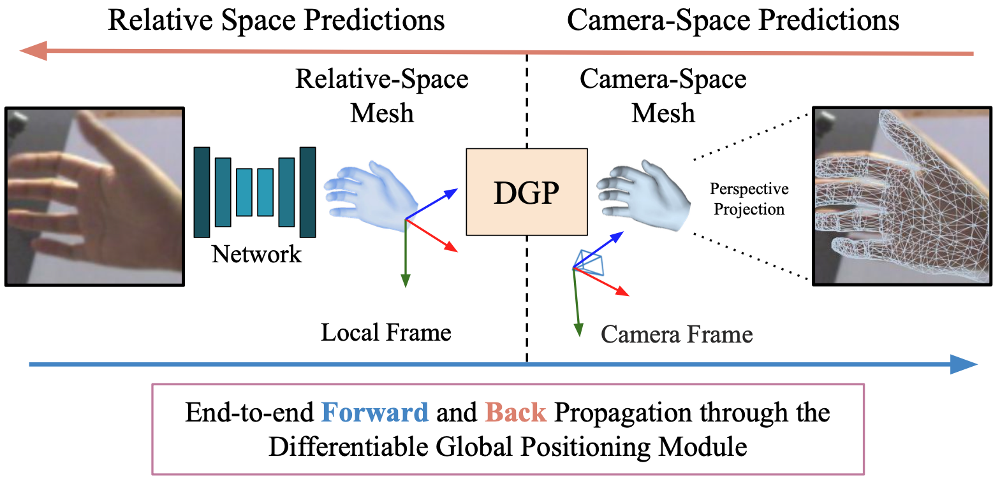

# HandDGP: Camera-Space Hand Mesh Predictions with Differentiable Global Positioning (ECCV 2024)

This is the reference PyTorch implementation for the method described in

> **HandDGP: Camera-Space Hand Mesh Predictions with Differentiable Global Positioning**
>
> [Eugene Valassakis](https://eugval.com/) [Guillermo Garcia-Hernando](https://guiggh.github.io/)
> 
> [Project Page](https://nianticlabs.github.io/handdgp/), [Video](https://youtu.be/jii_HR5uE8I)

<p align="center">
  
</p>

## 🗺️ Overview
We provide the model implementation of HandDGP, model weights trained on FreiHAND dataset and the code reproduce our main paper results. 

## ⚙️ Setup

We are going to create a new Mamba environment called `handdgp`. If you don't have Mamba, you can install it with:

```shell
make install-mamba
```

Then setup the environment with:
```shell
make mamba-env
mamba activate handdgp
```

In the code directory, install the repo as a pip package:
```shell
pip install -e .
```

Accept the licences of [MobRecon](https://github.com/SeanChenxy/HandMesh) and [MANO](https://mano.is.tue.mpg.de/) and then add to the third party folder:
```shell
mkdir third_party
cd third_party
git clone https://github.com/SeanChenxy/HandMesh.git
```


## 📦 Trained Models
We provide the model trained on FreiHAND dataset [here](https://storage.googleapis.com/niantic-lon-static/research/handdgp/handdgp_freihand.ckpt). Download the model and place it in the `weights` directory. Alternatively, you can run the following bash script: `scripts/download_weights.sh`.


## 💾  Data

Accept the licence and download the FreiHAND eval data from [here](https://lmb.informatik.uni-freiburg.de/resources/datasets/FreihandDataset.en.html) and extract it in `data/freihand/data/freihand/FreiHAND_pub_v2_eval`. Alternatively, you can run the following script: `scripts/download_data.sh`.

## 🌳 Folder structure

Please make sure to re-create this folder structure:
```
├── configs
├── data
│   ├── freihand
│   │   ├── FreiHAND_pub_v2_eval
├── scripts
├── outputs
│   ├── <experiment output folders>
├── src
│   ├── <source files>
├── weights
│   ├── <HandDGP weight files>
├── third_party
│   ├── HandMesh
├── LICENSE
├── Makefile
├── pyproject.toml
├── environment.yml
├── README.md
├── setup.py
```

## 🚀 Running HandDGP
To run HandDGP, please run the following command from the root folder:

```
python -m src.run --config_file configs/test_freihand.gin
```
This will generate an output file in the `outputs` directory with the test results on FreiHAND dataset in json format that you can directly use in the [FreiHAND evaluation code](https://github.com/lmb-freiburg/freihand).
``


## 🙏 Acknowledgements
We would like to thank the authors of the following repositories for their code, models and datasets:
- [MobRecon](https://github.com/SeanChenxy/HandMesh)
- [FreiHAND](https://lmb.informatik.uni-freiburg.de/resources/datasets/FreihandDataset.en.html)
- [MANO](https://mano.is.tue.mpg.de/)
- [SpiralNet++](https://github.com/sw-gong/spiralnet_plus)


## 📜 Citation

If you find our work useful in your research please consider citing our paper:

```
  @inproceedings{handdgp2024,
  title={{HandDGP}: Camera-Space Hand Mesh Prediction with Differentiable Global Positioning},
  author={Valassakis, Eugene and Garcia-Hernando, Guillermo},
  booktitle={Proceedings of the European Conference on Computer Vision (ECCV)},
  year={2024},
}
```

## 👩‍⚖️ License

Copyright © Niantic, Inc. 2024. Patent Pending.
All rights reserved.
Please see the [license file](LICENSE) for terms.